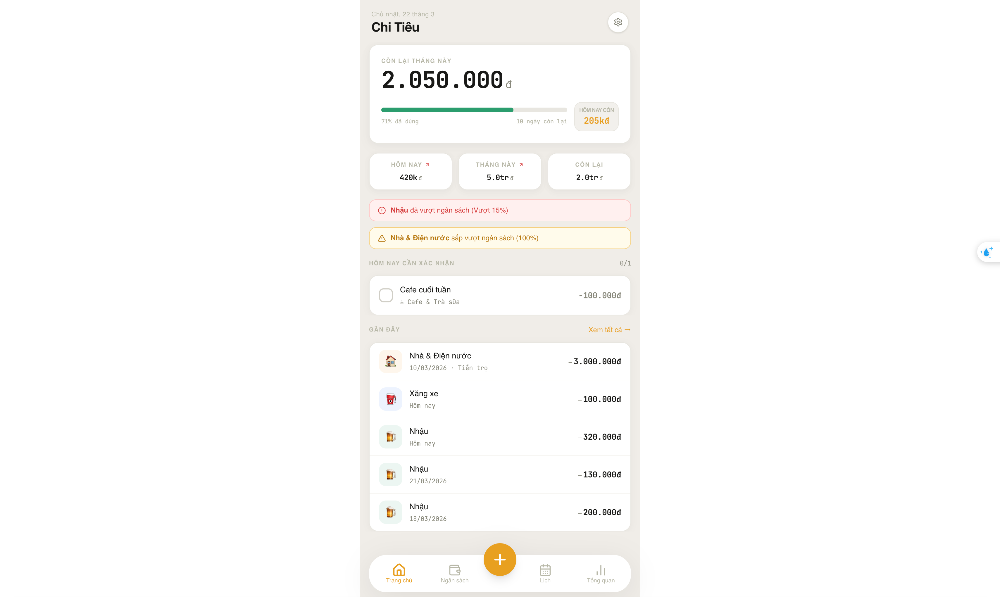
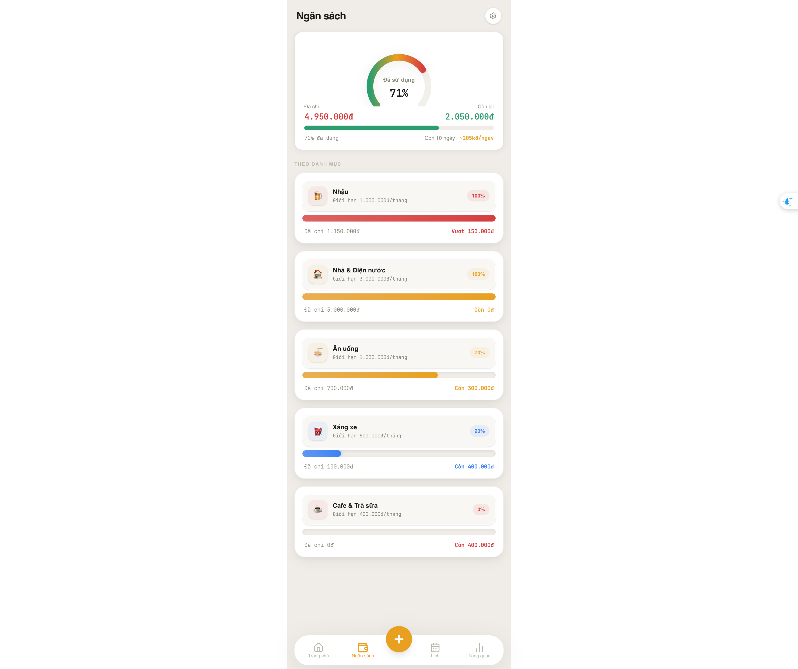

# Mochi 🍡 — Personal Money Tracker (PWA)

**Mochi** là một ứng dụng Web Progressive (PWA) cao cấp dành cho việc quản lý chi tiêu cá nhân. Với ngôn ngữ thiết kế **3D Neumorphic** và **Glassmorphism**, Mochi mang lại trải nghiệm phần mềm tài chính hiện đại, mượt mà và trực quan ngay trên trình duyệt và thiết bị di động của bạn.

---

## 📸 Giao diện

<div align="center">
  
  
  <p><i>Giao diện Home Comparison (Trái) và Budget 3D Distribution (Phải)</i></p>
</div>

---

## ✨ Tính năng nổi bật

- **Thiết kế 3D đẳng cấp**: Sử dụng hiệu ứng đổ bóng layer, kính mờ (glassmorphism) và các khối nổi neumorphic mang lại chiều sâu cho ứng dụng.
- **Theo dõi chi tiêu thời gian thực**: So sánh chi tiêu hôm nay với hôm qua bằng các icon mũi tên chỉ báo xu hướng.
- **Biểu đồ Budget 3D**: Biểu đồ hình tròn (Radial Chart) với hiệu ứng Neon và Category cards dạng nổi 3D đẹp mắt.
- **Quản lý khoản lặp lại**: Tự động nhắc nhở và quản lý các khoản chi cố định hàng tháng hoặc hàng ngày.
- **Hỗ trợ Offline (PWA)**: Hoạt động mượt mà ngay cả khi không có mạng nhờ Service Worker và cơ sở dữ liệu IndexedDB (Dexie).
- **Trải nghiệm Mobile-first**: Tối ưu hóa hoàn hảo cho màn hình cảm ứng di động với khung hình chuẩn 480px.

---

## 🛠 Công nghệ sử dụng

- **Frontend**: [React 19](https://react.dev/), [Vite](https://vitejs.dev/)
- **Styling**: [Tailwind CSS 4](https://tailwindcss.com/)
- **Database**: [Dexie.js](https://dexie.org/) (IndexedDB wrapper)
- **Charts**: [ApexCharts](https://apexcharts.com/)
- **Icons**: [Lucide React](https://lucide.dev/)
- **PWA**: [Vite PWA Plugin](https://vite-pwa-org.netlify.app/)

---

## 🚀 Cài đặt và Phát triển

### 1. Clone repository

```bash
git clone https://github.com/ttphat2805/mochi-money-pwa.git
cd pwa-money-app
```

### 2. Cài đặt dependency

```bash
npm install
```

### 3. Chạy môi trường Local

```bash
npm run dev
```

Sau khi chạy, ứng dụng sẽ có mặt tại `http://localhost:5173`.

### 4. Build bản Production

```bash
npm run build
```

---

## 📦 Deploy lên Vercel/Netlify

Dự án đã được cấu hình sẵn để deploy mượt mà lên các nền tảng Static Hosting.

- **Build command**: `npm run build`
- **Output directory**: `dist`

---

Developed with ❤️ for personal financial freedom.
Developed by **fat.tran**
